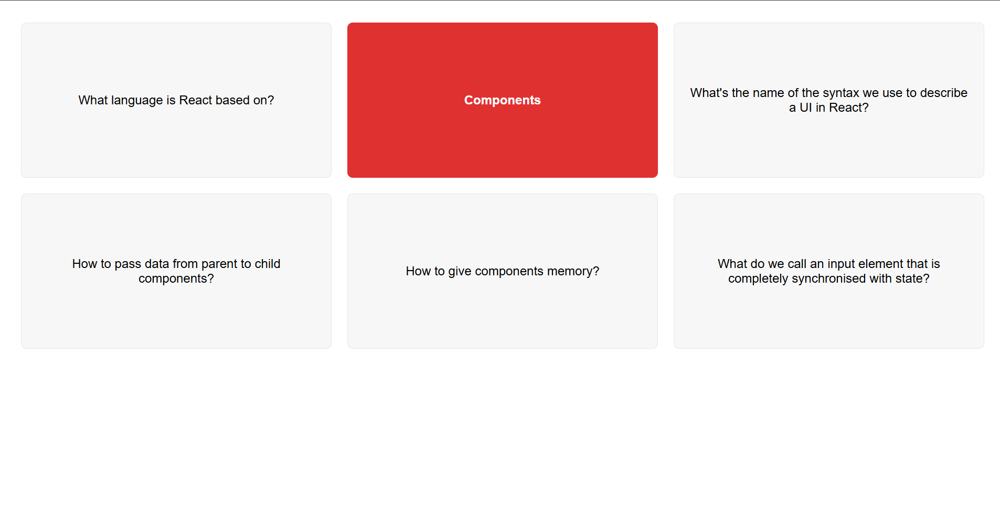

 ## 🧠 React Flashcards Practice
This is a simple and interactive flashcards app built with React to help you review and practice core React concepts. Each card asks a question related to React fundamentals, and clicking a card reveals the answer.

 ## 🚀 Features
 
📚 Flashcards with React-related questions and answers
  
🖱️ Click-to-reveal functionality for active recall
 
🎨 Simple and clean design
 
⚛️ Fully built with functional components and hooks

---

## 🧩 Topics Covered
 
JSX
 
Components
 
Props and State
 
Controlled Inputs
 
Data flow in React
 
useState Hook

---

## 🛠️ Tech Stack
 
React (Functional Components)
 
JavaScript (ES6+)
 
CSS
---

## 📸 Preview

()

---
## License
 
this Project is under the MIT License

---